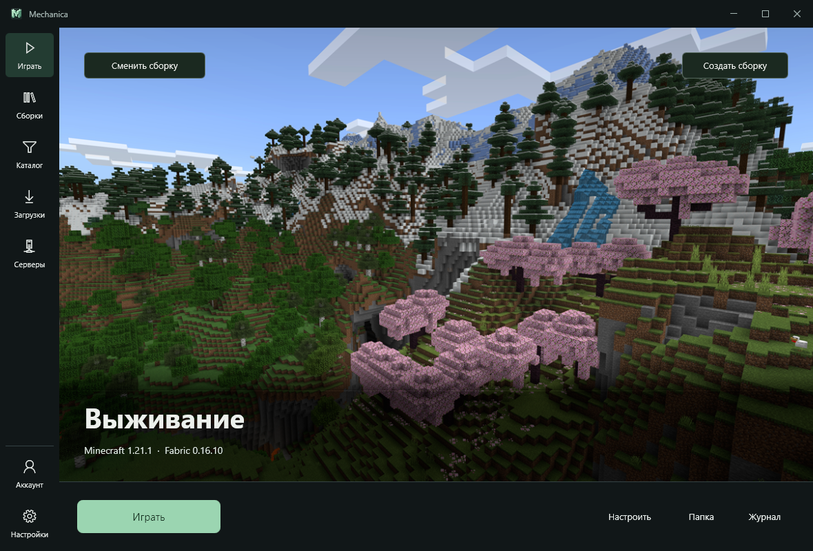
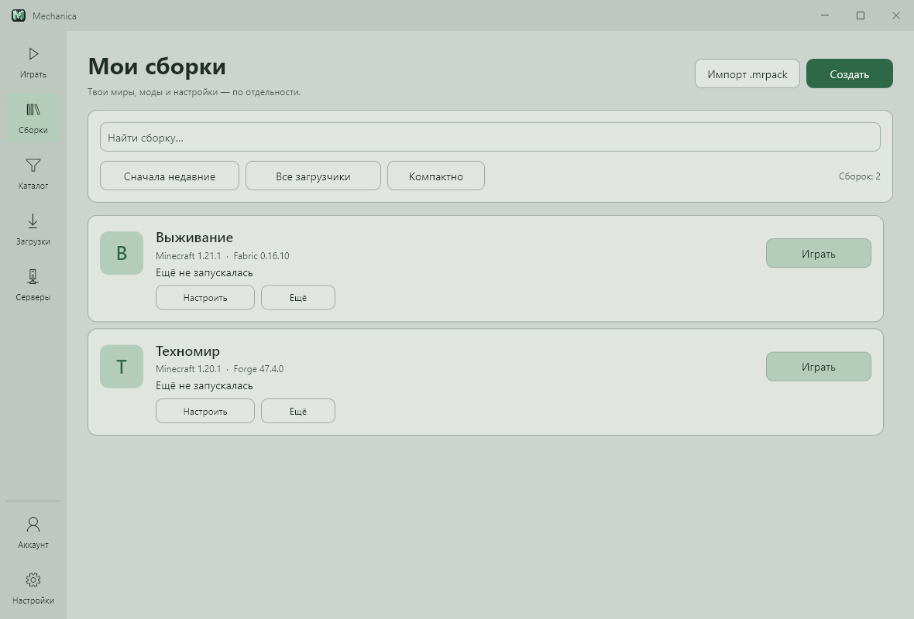
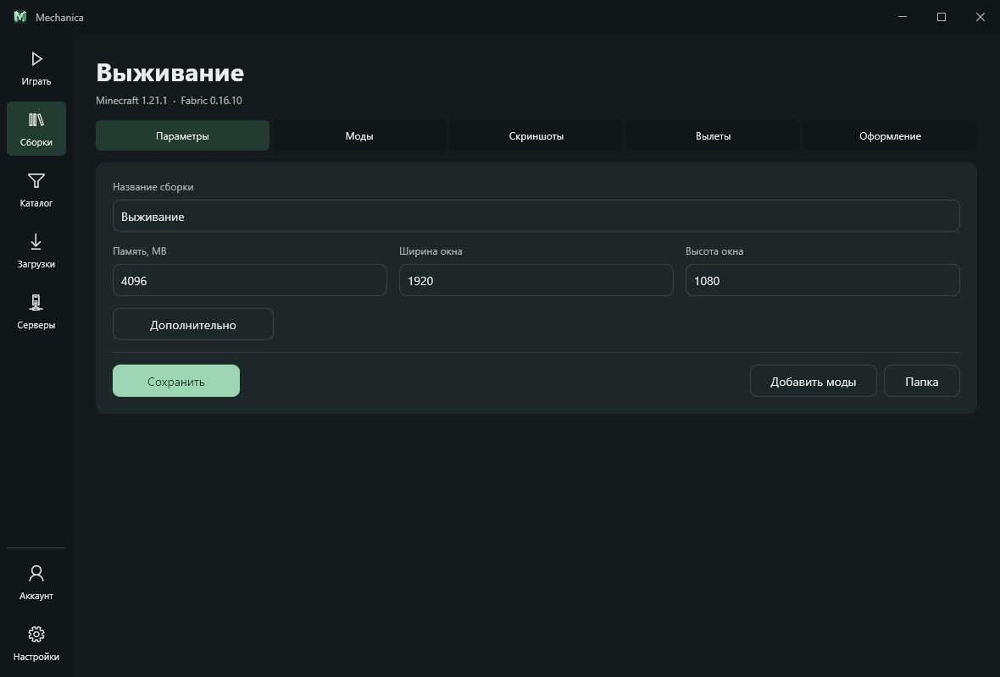

# Mechanica Launcher

Лаунчер Minecraft для Windows 10/11 x64. Отдельные сборки, моды из Modrinth и запуск игры с нужной версией и загрузчиком.

[Скачать 1.0.1](https://github.com/Ytin24/MechanicaLauncher/releases/tag/v1.0.1)

## Скачать

Версия 1.0.1 для Windows x64:

- **[Установщик](https://github.com/Ytin24/MechanicaLauncher/releases/download/v1.0.1/MechanicaLauncher-1.0.1-setup.exe)** — установи лаунчер и запускай его из меню «Пуск».
- **[Portable ZIP](https://github.com/Ytin24/MechanicaLauncher/releases/download/v1.0.1/MechanicaLauncher-x64-portable.zip)** — распакуй архив и открой `MechanicaLauncher.exe`. Сборки и настройки хранятся в папке `data` рядом с лаунчером.

Отдельно устанавливать .NET не нужно. Нумерация начинается заново с 1.0.0: при переходе с прежних 2.x, 3.x и 4.0.0-beta.1 скачай новую версию вручную — старый лаунчер считает её номер более низким. Перед заменой portable сохрани папку `data`.

## Возможности

- Отдельные сборки со своими мирами, модами и настройками. Импорт и экспорт `.mrpack`.
- Minecraft без модов, Fabric, Quilt, Forge и NeoForge. Подбор и загрузка нужной Java.
- Каталог Modrinth: моды, модпаки, шейдеры, ресурспаки и датапаки. Описания, скриншоты и фильтр по версии Minecraft.
- Распознавание установленных модов, включая переименованные и отключённые файлы. Совместимые обновления Modrinth с резервными копиями.
- [Mechanica Server Sync](https://github.com/Ytin24/MechanicaServerSync): докачка модов сервера, перезапуск игры и повторное подключение. Включается в настройках конкретной сборки.
- Очередь загрузок с отменой и повтором, проверка файлов и отчёты о вылетах.
- Любимые серверы, галерея игровых скриншотов, обложки сборок и редактор скина.
- Учётные записи Microsoft и локальные профили, Discord Rich Presence, сворачивание в трей.
- Светлая и тёмная темы, русский и английский интерфейс, отключаемые анимации.

[Проверенные версии и ограничения](COMPATIBILITY.md) · [Настройка синхронизации](docs/server-mod-sync.md)

## Сборки

## Параметры игры

Обложка на первом снимке — [Minecraft.net](https://www.minecraft.net/en-us/about-minecraft).

## Сборка из исходников

Клонировать с `git clone https://github.com/Ytin24/MechanicaLauncher.git`. Из папки репозитория выполнить `git submodule update --init --recursive -- mods/server-sync` — эта же команда обновляет мод в существующей копии.

На Windows нужны .NET SDK 9 и 10, JDK 8, 17, 21 и 25. Сначала выполнить `./scripts/Build-ServerSyncBridge.ps1`, затем `dotnet build tests/MechanicaLauncher.Desktop.Tests -c Release`. Настройка Java и варианты мода описаны в [его README](https://github.com/Ytin24/MechanicaServerSync#сборка). Полная сборка, тесты и упаковка выполняются в [CI](.github/workflows/build-release.yml).

[Сообщить об ошибке](https://github.com/Ytin24/MechanicaLauncher/issues)
