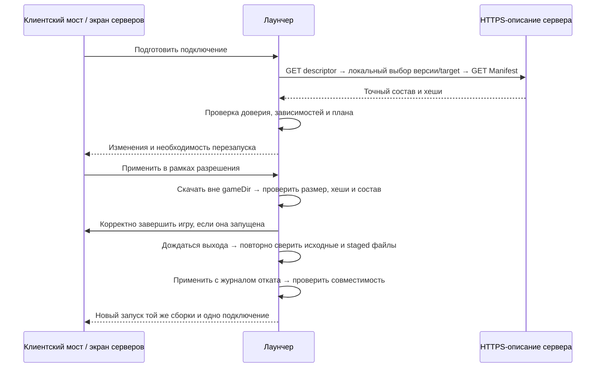

# Докачка модов сервера

Реализован протокол 1.0, серверный HTTP-компонент и клиентские мосты Fabric, Quilt, Forge и NeoForge. Исходники мода находятся в отдельном репозитории [MechanicaServerSync](https://github.com/Ytin24/MechanicaServerSync), подключённом к лаунчеру как submodule. Точные проверенные сочетания Minecraft и загрузчиков указаны в [отчёте](../COMPATIBILITY.md).
Цель — подготовить выбранную сборку для сервера, при необходимости перезапустить игру и подключиться повторно.
Протокол лаунчера не зависит от версии Minecraft. Обмен списком модов и связь с лаунчером общие; различия версий изолируются только в коде загрузки моста и обращения к игре. Отдельный вариант на каждый релиз заранее не требуется: одну сборку моста проверяем на максимально широком совместимом диапазоне.

## Использование

В настройках сборки включить **Mechanica Server Sync**, затем подключиться из Minecraft. Сервер с обновлённым модом объявляет адрес списка модов в ответе на обычный status ping. Лаунчер обнаруживает его без записи в «Любимых серверах» и запрашивает подтверждение перед загрузкой. Обнаруженный сервер не сохраняется автоматически.

Явный адрес списка в «Любимых серверах» имеет приоритет и подходит для серверов со старым модом. Для автоматической установки у сохранённого сервера можно включить «Автодокачка модов». Смена адреса, списка или сборки снимает это разрешение. Внешний сервер использует HTTPS; локальный тест допускает HTTP на буквальном loopback-адресе.

При запуске сборки с включённой синхронизацией лаунчер выбирает мост по точным Minecraft и загрузчику, проверяет SHA-512 и устанавливает его. Снятая галочка отключает установленный лаунчером мост и создание IPC-сессии. Если подключение начато внутри Minecraft, файлы сначала скачиваются отдельно, игра штатно выходит, лаунчер применяет изменения и запускает её снова. Цикл автоматического перезапуска ограничен одним повтором. Изменённые личные моды дают конфликт, а не перезаписываются.

Сборка и конфигурация серверного JAR: [mods/server-sync/README.md](../mods/server-sync/README.md). Повторяемый интеграционный тест: `scripts/Test-ServerSync.ps1 -DownloadAndRun -AcceptEula -Discovery`; он создаёт отдельный локальный сервер и клиентские данные без сохранённого адреса списка, затем сохраняет журналы и `result.json` в `out/server-sync-*`. Без `-Discovery` проверяется явно сохранённый адрес.

Обычное обновление установленных модов доступно через «Каталог → Установлено → Проверить обновления». Оно использует [пакетный API Modrinth](https://docs.modrinth.com/api/operations/getlatestversionsfromhashes/) и выбирает более новые стабильные версии для текущих Minecraft/загрузчика. Серверные управляемые файлы из этой проверки исключены: они следуют манифесту сервера. Пользователь видит выбранные обновления и обязательные зависимости перед установкой; отключённые моды остаются отключёнными. Резервные копии заменённых файлов сохраняются в `.minecraft/.mechanica/mod-updates/<transaction>/backup`.

## Состав решения

- Лаунчер получает перечень файлов, строит изменения, скачивает, проверяет и применяет их к конкретной сборке.
- Клиентский мост — небольшой мод без игрового контента: передаёт попытку подключения лаунчеру, сообщает состояние игры, выполняет согласованный выход и подключение.
- Серверный компонент публикует утверждённый владельцем состав клиента. Обычный Minecraft-сервер такого перечня со ссылками и хешами не предоставляет.
- Лаунчер умеет проверить список из экрана серверов до запуска игры. Автоматическая проверка при запуске тоже учитывает галочку конкретной сборки.
- Установленный мост добавляет тот же сценарий при подключении из Minecraft. Его отсутствие не должно блокировать обычное использование лаунчера.

## Что означает «адаптер»

Пользовательский сценарий один: запросить нужные серверу клиентские моды → сравнить с установленными → докачать через лаунчер → штатно выйти → применить файлы → запустить игру и подключиться.
Мост передаёт лаунчеру адрес выбранного сервера; лаунчер получает адрес описания через стандартный Minecraft status ping, а сам список — по HTTPS. Сравнение хешей, скачивание и локальный протокол общие для всех вариантов.
Различаются входная точка Fabric/Forge/NeoForge, добавление объявления в status и код, который замечает попытку подключения, приостанавливает её и штатно завершает игру. Это небольшая часть мода, зависящая от используемых классов/событий; общий механизм докачки остаётся один. Например, [Fabric задаёт отдельную клиентскую точку входа и конфигурацию mixin](https://docs.fabricmc.net/1.21.1/develop/getting-started/project-structure).
Не создавать отдельную систему адаптеров заранее. Сначала проверить общий мост на нескольких версиях; выделять различающийся код только при доказанной несовместимости. Один JAR может покрыть несколько версий, но покрытие всех загрузчиков и всех Minecraft устанавливается проверкой, а не отсутствием игрового контента в моде.

## Как получить список до отказа сервера

Мост перехватывает подключение до входа в игровой протокол. Если для адреса нет сохранённого списка, лаунчер отправляет Minecraft status handshake на фактические host/port. Сервер добавляет в корень обычного JSON-ответа:

```json
"mechanica": {"protocol": 1, "descriptorUrl": "https://mods.example.org/mechanica/descriptor.json"}
```

Остальные поля status сохраняются. Объявление существует только пока запущен HTTP-компонент; URL берётся из настроенного `baseUrl`. Ни HTTP-порт, ни путь не угадываются. Для автообнаружения необходимы обновлённые лаунчер и серверный JAR; старому JAR можно явно задать адрес в «Любимых серверах».

`protocol` объявления — целое `1`, URL — абсолютный HTTPS, до 2048 символов, без данных входа и fragment. HTTP допустим только если и игровой адрес, и адрес описания — буквальные loopback IP. Объявление с неверным форматом даёт ошибку. Отсутствие объявления или недоступность status оставляет обычное подключение без HTTP-запроса. Подтверждение для обнаруженного сервера обязательно при изменениях; оно показывает источник загрузки.

Проверка списка выполняется **до игрового входа**. Поэтому загрузчик ещё не успевает отклонить клиента с недостающим модом. Завершающая точка DNS-имени и регистр не мешают сопоставлению с сохранённым сервером.

В v1 весь обмен списком идёт по HTTPS; отдельные login/configuration/play payload не нужны. Причина запроса до соединения: загрузчик может отклонить клиента с недостающими модами раньше дополнительного обмена. Например, в NeoForge 1.21.1 [согласование каналов предшествует configuration tasks](https://github.com/neoforged/NeoForge/blob/1.21.1/patches/net/minecraft/server/network/ServerConfigurationPacketListenerImpl.java.patch), а [отсутствующий обязательный канал вызывает отказ](https://github.com/neoforged/NeoForge/blob/1.21.1/src/main/java/net/neoforged/neoforge/network/registration/NetworkRegistry.java#L324).

## Обмен и версии

Формат — JSON UTF-8. Bootstrap работает с обычным статическим хостингом, без обязательного `POST` и без передачи списка личных файлов:

1. `GET <сохранённый или объявленный descriptor URL>` с `Accept: application/json`, без добавления собственного пути/query. Ответ `200` содержит `descriptorVersion: 1` и массив `protocols`; каждый элемент объявляет доступную пару `major/minor`, обязательные возможности и targets.
2. Лаунчер локально пересекает этот список со своими поддерживаемыми парами и выбирает старшую общую пару. Отсутствие общей версии, неизвестный `descriptorVersion` или обязательная возможность дают `unsupported_protocol`; по ошибке проверки нельзя пробовать менее строгую версию.
3. Найти target по точным Minecraft/loader/loaderVersion; выполнить `GET <manifestUrl>` из выбранного элемента. Проверить SHA-512 байтов ответа из descriptor, затем совпадение протокола, serverId и target. Обновление публикуется новым manifest URL/хешем, затем заменой descriptor; `304` допустим только с уже проверенными кешированными байтами для того же URL/ETag.

Версии протокола, Minecraft и моста — разные поля. `major/minor` — целые 1..65535/0..65535; Minecraft сравнивается по точному ID, без предположения о SemVer. Незнакомые необязательные поля выбранного minor игнорируются, обязательные возможности проверяются явно.
`serverId` — UUID, не доказательство доверия. `targetId`/`artifactId` — регистрозависимые строки `[a-z0-9][a-z0-9._-]{0,63}`; target неизменно задаёт одну тройку Minecraft/loader/loaderVersion. Для vanilla оба поля loader равны `null`; смена тройки требует нового targetId.
`revision` — целое 1..9007199254740991, строго растущее для пары serverId/targetId; изменение состава требует новой ревизии. `expiresUtc` — время UTC в RFC 3339; просроченные данные не применяются. `planId` связан с ревизией и SHA-512 исходных байтов Manifest; другой хеш той же ревизии — ошибка.

**Пример HTTP-обмена:** ниже два отдельных тела ответа — descriptor и Manifest. Домен `.example`, ID проекта/версии, размеры и хеши иллюстративные; `<...>` нужно заменить проверенными значениями, эти данные не пригодны для установки.

```json
{
  "descriptorVersion": 1, "serverId": "b3a38c5e-593c-4bdd-9046-e019b3453eb0",
  "protocols": [{"major": 1, "minor": 0, "requiredCapabilities": ["mods-v1"],
    "targets": [{"targetId": "fabric-1.21.1", "minecraft": "1.21.1", "loader": "fabric", "loaderVersion": "0.19.3",
      "manifestUrl": "https://sync.example/pack/r7.json", "sha512": "<manifest-sha512>"}]}]
}
```
```json
{
  "type": "Manifest", "protocolMajor": 1, "protocolMinor": 0,
  "serverId": "b3a38c5e-593c-4bdd-9046-e019b3453eb0", "targetId": "fabric-1.21.1", "revision": 7, "expiresUtc": "2026-09-28T12:00:00Z",
  "minecraft": "1.21.1", "loader": "fabric", "loaderVersion": "0.19.3",
  "files": [{"artifactId": "example-mod", "modIds": ["example"], "client": "required", "filename": "example.jar",
    "size": 123456, "sha512": "<file-sha512>", "dependencies": [],
    "source": {"type": "modrinth", "projectId": "<project-id>", "versionId": "<version-id>"}}]
}
```

IPC после `BridgeHello`: один кадр = длина JSON в байтах (`uint32`, little-endian) и UTF-8 JSON; превышение лимита отклоняется до выделения буфера. Оболочка: `type`, выбранные `protocolMajor/protocolMinor`, `sessionId`, `instanceId`, `requestId`, `expiresUtc`, `payload`. Ответ повторяет requestId; секрет передаётся только при авторизации соединения, не в каждом сообщении.

| Сообщение | Минимальные данные |
| --- | --- |
| `BridgeHello` → локальный IPC | Bootstrap версии 1: сессия, токен, версии протокола/адаптера, возможности. Лаунчер отвечает `BridgeReady` с выбранной парой; обычные сообщения до этого не принимаются. |
| `PrepareConnection` → лаунчер | Фактический host/port и известная ревизия; сборку и endpoint не выбирает серверный пакет. |
| `Plan` → мост | planId, revision, manifestSha512, счётчики изменений, размер, restartRequired; полный список файлов доступен в лаунчере. |
| `Apply` / `Cancel` → лаунчер | Новый requestId и ранее выданный planId в той же сессии; Apply начинает staging в рамках действующего разрешения. |
| `Result` / `Reconnect` → мост | Статус/ошибка операции либо одноразовое разрешение подключения к исходному адресу в новой сессии. |

**Пример локального обмена:** два отдельных JSON-кадра после авторизации — запрос и ответ; значения также иллюстративные.

```json
{"type":"PrepareConnection","protocolMajor":1,"protocolMinor":0,
 "sessionId":"60390fd0-cdbe-4c17-ae7c-02e8eaf916af","instanceId":"survival","requestId":"e0e24f37-6af3-41a1-aabd-37ea59881877","expiresUtc":"2026-09-27T12:15:00Z",
 "payload":{"host":"play.example","port":25565,"knownRevision":6}}
```
```json
{"type":"Plan","protocolMajor":1,"protocolMinor":0,
 "sessionId":"60390fd0-cdbe-4c17-ae7c-02e8eaf916af","instanceId":"survival","requestId":"e0e24f37-6af3-41a1-aabd-37ea59881877","expiresUtc":"2026-09-27T12:15:00Z",
 "payload":{"planId":"a0a520fe-066a-473b-9366-f053fd3bd6cc","revision":7,"manifestSha512":"<manifest-sha512>","add":1,"replace":0,"conflicts":0,"downloadBytes":123456,"restartRequired":true}}
```

requestId/sessionId/planId — UUID v4. Запрос действителен до expiresUtc, не далее 15 минут от получения; повтор с тем же `(sessionId, requestId)` и содержимым возвращает прежний ответ/текущее состояние, а изменённое содержимое даёт `invalid_request`.
Хранить до 128 принятых requestId на сессию до их expiresUtc, активные — до завершения; один слот зарезервировать для Cancel активного плана. Не вытеснять действующие записи: `busy` означает, что запрос ещё не принят, и не кешируется как его окончательный результат. Истёкший запрос даёт `request_expired`; повтор выполняется новым requestId, а уже применённый planId из журнала никогда не коммитится второй раз.
Одновременно допускается одна активная транзакция на сборку. Неиспользованный план истекает через 15 минут; новая ревизия требует нового плана, старую не принимать автоматически после более новой. Версию выбранной сборки не подменять молча.
Если изменений нет, подключиться сразу, без загрузки и перезапуска. Недоступное описание не разрешает установку по непроверенному списку; обычное подключение остаётся отдельным действием.

### Ошибки и повтор

`Result.payload` содержит `status`, `phase`, `planId`, а при ошибке — `code`, `retryable` и при необходимости artifactId/retryAfterMs; не передавать stack trace пользователю. Фазы: `plan`, `download`, `awaiting_exit`, `commit`, `rollback`, `launch`, `complete`.

| Код | Повтор |
| --- | --- |
| `unsupported_protocol` / `target_mismatch` | Автоматически нет: нужен совместимый мост/лаунчер либо другой target/instance. |
| `conflict` | Нет: решить конкретное расхождение личного файла, затем построить новый план. |
| `hash_mismatch` / `invalid_manifest` | Нет: прежние файлы сохраняются, источник должен исправить данные; повреждённый staging не публикуется. |
| `busy` | После завершения текущей операции/указанной задержки повторить тот же ещё действующий запрос. |
| `cancelled` | Только новое явное действие; проверенные скачанные байты можно использовать повторно. |
| `network_error` | До двух повторов GET с задержкой и отменой; исчерпание попыток завершает операцию без commit. |
| `invalid_request` / `request_expired` | Исправить запрос/создать новый; повтор Apply не создаёт вторую транзакцию для того же planId. |

Cancel идемпотентен: во время download останавливает загрузки; до commit оставляет сборку нетронутой; во время commit завершает откат до ответа `cancelled`. После успешного commit возвращает фактическое состояние `applied` и отменяет ещё не начатый автозапуск; уже запущенную игру автоматически не завершает. После выхода старой игры отмена остаётся доступной в лаунчере по planId, без восстановления старого IPC-токена.

## Файлы, зависимости и стороны

- Запись мода: `artifactId`, `modIds`, `client: required|optional|unsupported`, имя JAR, размер, SHA-512, точные зависимости; источник `modrinth` либо `external`.
- Для Modrinth фиксировать `projectId`, `versionId` и конкретный файл по имени и хешу. Самостоятельно получить версию из API: проверить принадлежность проекту, Minecraft, loader, размер и SHA-512; URL брать из ответа API.
- У Modrinth нет необходимости придумывать отдельный универсальный `fileId`: [версия содержит файлы, хеши и зависимости](https://docs.modrinth.com/api/operations/getversion/). Известный хеш подтверждает файл, но не гарантирует безопасность его кода.
- Неизвестный проект/файл не искать по похожему названию. Для внешнего файла нужны явный HTTPS-источник, размер, хеш и отдельное согласие; автоматическое доверие Modrinth на него не переносится.
- Серверные моды с `client: unsupported` не скачиваются клиенту. Клиентские необязательные моды выбирает пользователь; наличие JAR на сервере само по себе не делает его обязательным на клиенте.
- Владелец сервера утверждает клиентский состав; metadata о стороне помогает проверить его, но не заменяет это решение. Личные клиентские моды сохраняются, пока нет конкретного конфликта.
- Required-зависимости разрешаются до показа плана и фиксируются точными версиями/файлами. Никакого выбора «последней версии» посреди установки; embedded-зависимости не скачиваются повторно, optional требуют выбора.
- Проверить замкнутость зависимостей, несовместимые версии, повторяющиеся mod ID, Minecraft, loader и Java. Затем проверить собранный набор через `ModCompatibilityChecker`; окончательную проверку выполняет сам загрузчик при запуске.
- Первый этап устанавливает только JAR в `mods`. Конфиги, скрипты и ресурсы — отдельное расширение протокола с явными типами/путями; до него не обещать полную совместимость сборок, требующих таких файлов.

## Доверие и локальная связь

Доверие включается пользователем для сочетания «игровой host:port + HTTPS origin + сборка». Один короткий выбор при первом обновлении: установить сейчас; разрешить дальнейшие проверенные обновления этого сервера — отдельная опция. Смена origin/сборки не наследует разрешение; `serverId` из ответа не доказывает личность сервера.
Для автоматически разрешённых обновлений показывать изменения и прогресс без повторяющихся модалок. Конфликт личного файла или новый внешний источник требуют решения; отказ отменяет синхронизацию, а не использование всего лаунчера.
В Windows использовать локальный named pipe с доступом текущего пользователя и запретом удалённых подключений. Лаунчер создаёт случайный токен на каждый запуск; передаёт его только запущенному процессу через окружение, без URI, argv, логов и файла конфигурации.
Проверять токен, `sessionId`, точный `instanceId`, PID и время старта отслеживаемого процесса; после завершения игры токен недействителен. Дубликаты `requestId` идемпотентны. Сервер никогда не получает IPC-токен.
Одобренная транзакция переживает выход исходной игры; новый процесс получает новую сессию и токен. Разрешение на одно переподключение хранит лаунчер, старый токен его повторно не создаёт.
Мост сообщает адрес текущей попытки подключения; разрешённую запись сервера определяет лаунчер. Пакет не может выбрать другой instance, путь, исполняемый файл, Java или JVM-аргументы.
Это защита от поддельного внешнего запроса и устаревшей сессии, не песочница от вредоносного мода внутри той же JVM и не античит. Отчёт клиента не доказывает серверу отсутствие постороннего кода.

## Применение и перезапуск



Новые обычные JAR-моды требуют перезапуска JVM: загрузка классов, mixin и регистраций происходит при старте; горячую установку не закладываем. Например, [Fabric Loader запрещает повторную загрузку после freeze](https://github.com/FabricMC/fabric-loader/blob/master/src/main/java/net/fabricmc/loader/impl/FabricLoaderImpl.java).
При уже открытом мире не завершать игру автоматически: ждать нормального выхода/согласованного завершения. Таймаут выхода отменяет применение; `Process.Kill` не является штатным шагом синхронизации.
Скачивание через `DownloadQueue` идёт в отдельный staging вне gameDir, пока игра работает. После проверки предложить согласованный выход; до выхода соответствующего процесса его файлы не меняются. Commit проходит под блокировкой конкретной сборки. Каждая загрузка поддерживает отмену и потоковую проверку размера/хеша.
Хранить отдельный реестр управляемых сервером файлов: путь, исходный/текущий хеш, сервер и ревизия. Заменять/убирать только его неизменённые записи; совпадение имени или mod ID не даёт права удалить личный мод.
Перед применением повторно сверить текущие хеши: изменения после построения плана считаются конфликтом. Все исходные заменяемые файлы сохраняются, затем применяется журналируемая транзакция. Отмена, нехватка места, повреждение загрузки или прерванная запись восстанавливают прежние файлы; после сбоя журнал восстанавливается до следующего запуска.
Конфликт с личным содержимым показывается по конкретному файлу; вариант — отдельная сборка для сервера. Не очищать `mods`, миры, настройки, скриншоты и пользовательские ресурсы целиком.
После успешного применения запустить ту же сборку с точными loader/Java и исходным адресом. Автоподключение — один раз на транзакцию; повторный отказ/изменение состава останавливает цикл и сохраняет отчёт. После запуска чужого кода не обещать откат всех его побочных изменений.

## Границы недоверенного ввода

Пределы v1: JSON до 1 МиБ, глубина 16, до 2048 файлов, до 512 МиБ на файл и 4 ГиБ на план; управляющее сообщение моста до 16 КиБ. Ответ сервера не может их увеличить.
HTTPS без redirects; манифест и внешние файлы доступны с разрешённого источника. URL из Modrinth проверяется отдельно: файл должен соответствовать точной версии API и находиться на `cdn.modrinth.com`. Cookies и авторизация не передаются.
По умолчанию запрещены loopback, link-local и внутренние адреса. Для локальной проверки допустим HTTP URL с буквальным loopback: явно сохранённый с разрешением локальной синхронизации либо объявленный игровым сервером, к которому тоже подключаются по буквальному loopback IP. Проверяется фактический адрес соединения; действуют таймауты и предел байтов независимо от Content-Length. Произвольные LAN-источники пока не включены.
Для v1 разрешён только обычный `mods/<filename>.jar`: запрет абсолютных путей, `..`, ADS/двоеточий, Windows device names, нормализационных коллизий и reparse points на всём пути. Повторная проверка перед записью; манифест не задаёт команды и не распаковывается как произвольный архив.

## Код и проверка

[`GameSessions.ServerSync`](../src/MechanicaLauncher/Desktop/GameSessions.ServerSync.cs) связывает очередь, согласие пользователя, PID игровой сессии и повторный запуск. Скачивание выполняется отдельно при запущенной игре; применение проходит после её завершения под общей блокировкой подготовки. [`ServerModSync`](../src/MechanicaLauncher.Core/Servers/ServerModSync.cs) проверяет сеть, манифест, хеши и локальный снимок, ведёт отдельный реестр и журнал отката. [`GameBridgeSession`](../src/MechanicaLauncher.Core/Servers/GameBridgeSession.cs) авторизует конкретный игровой процесс через named pipe.
Старый [`ModSyncer`](../src/MechanicaLauncher.Core/Config/ModSyncer.cs) не используется для нового протокола. Настройки событий продолжают ограничивать установку; ссылка `EVENT` сама по себе не даёт серверу разрешение менять моды.

Автоматические проверки ядра покрывают протокол, совместимость, личные конфликты, неверные хеши, отмену, обрыв IPC, повтор запросов, сбой записи и восстановление транзакций. Java-проверки покрывают общий код моста и публикацию файлов. Проверки Desktop используют Nitidus HeadlessHost для настроек и отдельные дочерние процессы для жизненного цикла игры.

Игровой прогон создаёт выделенный сервер на `127.0.0.1` и новую клиентскую сборку. Проверяет отсутствующий мод, реальную докачку, выход первой JVM, запуск второй, загрузку нового мода и вход на сервер. Затем выполняет повторный вход без докачки и вход с выключенной синхронизацией. SHA-512, личные файлы и коды завершения сверяются отдельно.

`scripts/Test-ServerSyncMatrix.ps1 -DownloadAndRun -AcceptEula` запускает матрицу, записывает отдельные журналы, `result.json` и общий `summary.json`. Java задаётся параметрами `-Java8Path`, `-Java17Path`, `-Java21Path`, `-Java25Path` либо через `JAVA_HOME_<major>_X64`. `-Targets` ограничивает список сочетаний. Перед запуском нужны собранные мосты и проект `MechanicaLauncher.Desktop.Tests`; для отдельного каталога тестовых бинарей есть `-TestExecutable`.

`scripts/Test-ModUpdates.ps1 -DownloadAndRun` проверяет настоящие обновления Modrinth в изолированных папках: включённый и отключённый переименованный JAR, совместимость, применение, хеши, backup и повторную проверку. Этот прогон не запускает скачанные сторонние моды в Minecraft.

Результаты по конкретным версиям и ограничения проверки — в [COMPATIBILITY.md](../COMPATIBILITY.md). Протокол общий, но успех на одной версии не подтверждает все промежуточные версии Minecraft и загрузчиков.
